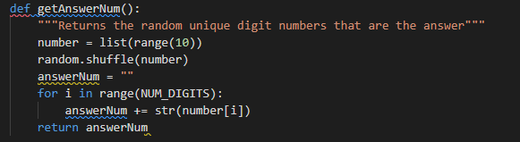
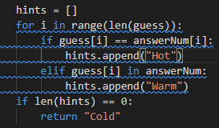
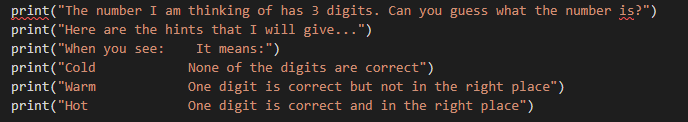
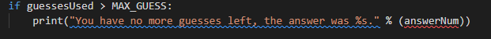

# Mastermind Python Game

## What is the game?

This is a python coded game that runs in the terminal. The aim of the game is for the player to guess the randomly generated 3 digit number within 10 guesses, there are three types of hints given after every guess. 
These are cold, warm and hot:
* Cold - This means none of the digets are correct.
* Warm - This means a digit is correct but in the wrong position.
* Hot - This means a digit is correct and in the right position.

After the 10 guesses have been fufilled, if the number is guessed correctly a message advising this will appear and then the option to play again.
If the number is not guessed correctly after the 10 tries a message advising end of chances and option to play another game.

## Game flow chart

 ## Main functions in the game

 ### Getting a unique random number

 

 This was achieved by using the random.shuffle function, this will randomly change the order of the provided list's items. The data type for answerNum is set to string as if it was set to numbers the digits provided would be added together to give a total instead of being placed together to form the 3 digit number. 

 ### Assigning the hints

 The names cold, warm, hot for the hints are used as they are clear on meaning. If the guess does not match the random number the hints then come in to action, this is done by looping through the indexs for answerNum and guess.
 If the hints list is empty after the loop this is where it is assigned the cold hint as none of the digits match. 

 ### How the game starts

 The print function is used to display the game information for the user at the start of the game, then the option to make the first guess is presented. String interpolation is used to display what the current guess number is. 

 ## Testing

 The main form of testing I have used for this project has been print statements throughout my code so I could see where it was going wrong and where the code needed to be fixed, this was done regularly to stop issues building.

 ## Deployment 

I followed the steps below to deploy my website on GitHub:

1. Deployed project to Heroku
2. Connected Github account
3. Go in to Github repository and click on “Settings”
4. Find the “Source” section and select “Master Branch”
5. Once “Master Branch” has been selected, the website is now published with link provided.

